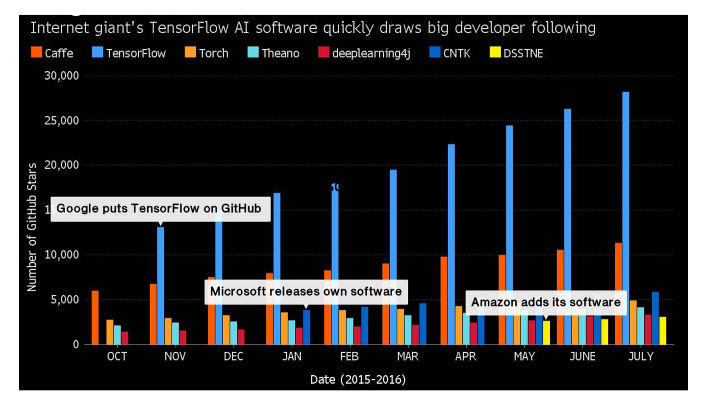

# 1.3. 深度学习框架介绍

学习目标
----

*   目标
    *   了解常见的深度学习框架
    *   了解TensorFlow框架
*   应用
    *   无
*   内容预览
    *   1.3.1 常见深度学习框架对比
    *   1.3.2 TensorFlow的特点
    *   1.3.3 TensorFlow的安装

1.3.1 常见深度学习框架对比
----------------

蒙特利尔理工学院

*   总结：

    *   最常用的框架当数TensorFlow和Pytorch, 而 Caffe 和 Caffe2 次之。
    *   PyTorch 和 Torch 更适用于学术研究（research）；TensorFlow，Caffe，Caffe2 更适用于工业界的生产环境部署（industrial production）
    *   Caffe 适用于处理静态图像（static graph）；Torch 和 PyTorch 更适用于动态图像（dynamic graph）；TensorFlow 在两种情况下都很实用。
    *   Tensorflow 和 Caffe2 可在移动端使用。

1.3.2 TensorFlow的特点
-------------------

官网：[https://www.tensorflow.org/](https://www.tensorflow.org/)

*   高度灵活（Deep Flexibility）
    *   它不仅可以用来做神经网络算法研究，也可以用来做普通的机器学习算法，甚至是只要把计算表示成数据流图，都可以用TensorFlow。
*   语言多样（Language Options）
    *   TensorFlow使用C++实现的，然后用Python封装。谷歌号召社区通过SWIG开发更多的语言接口来支持TensorFlow。
*   设备支持
    *   TensorFlow可以运行在各种硬件上，同时根据计算的需要，合理将运算分配到相应的设备，比如卷积就分配到GPU上，也允许在 CPU 和 GPU 上的计算分布，甚至支持使用 gRPC 进行水平扩展。
*   Tensorboard可视化
    *   TensorBoard是TensorFlow的一组Web应用，用来监控TensorFlow运行过程，或可视化Computation Graph。TensorBoard目前支持5种可视化：标量（scalars）、图片（images）、音频（audio）、直方图（histograms）和计算图（Computation Graph）。TensorBoard的Events Dashboard可以用来持续地监控运行时的关键指标，比如loss、学习速率（learning rate）或是验证集上的准确率（accuracy）

1.3.3 TensorFlow的安装
-------------------

### 1 CPU版本

安装较慢，指定镜像源，请在带有numpy等库的虚拟环境中安装

* ubuntu安装

  pip install tensorflow==1.8 -i https://mirrors.aliyun.com/pypi/simple

* MacOS安装

  pip install tensorflow==1.8 -i https://mirrors.aliyun.com/pypi/simple

### 2 GPU版本

参考官网：

*   [在 Ubuntu 上安装 TensorFlow](https://www.tensorflow.org/install/install_linux)
*   [在 macOS 上安装 TensorFlow](https://www.tensorflow.org/install/install_mac)

> 注：
>
> CPU与GPU的对比
>
> CPU：核芯的数量更少；
>
> 但是每一个核芯的速度更快，性能更强；
>
> 更适用于处理连续性（sequential）任务。
>
> GPU：核芯的数量更多；
>
> 但是每一个核芯的处理速度较慢；
>
> 更适用于并行（parallel）任务。