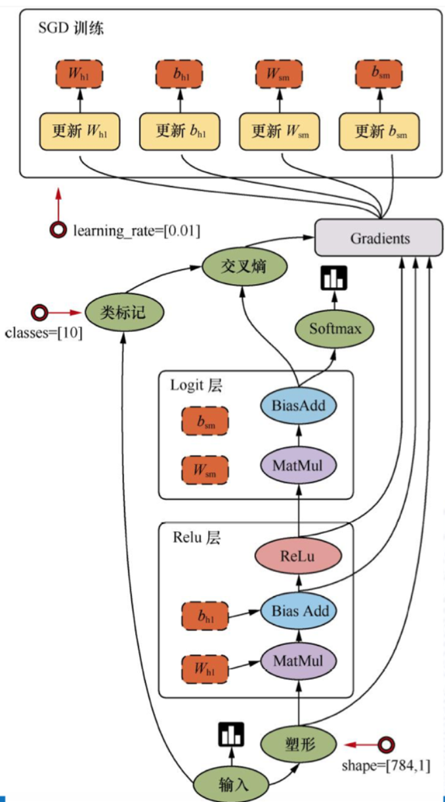

# 2.1. TF数据流图

学习目标
----

*   目标
    *   说明TensorFlow的数据流图结构
*   应用
    *   无
*   内容预览
    *   2.1.1 案例：TensorFlow实现一个加法运算
        *   1 代码
        *   2 TensorFlow结构分析
    *   2.1.2 数据流图介绍

2.1.1 案例：TensorFlow实现一个加法运算
---------------------------

### 1 代码

```python
# 实现一个加法运算
con_a = tf.constant(3.0)
con_b = tf.constant(4.0)

sum_c = tf.add(con_a, con_b)

print("打印con_a：\n", con_a)
print("打印con_b：\n", con_b)
print("打印sum_c：\n", sum_c)

# 会话,默认只能运行默认的图，不能运行其它的（可以通过参数解决）
with tf.Session() as sess:
    print("con_a的值为：\n", sess.run(con_a))
    print("con_b的值为：\n", sess.run(con_b))
    print("sum_c的值为：\n", sess.run(sum_c))
```


> 注意问题：警告指出你的CPU支持AVX运算加速了线性代数计算，即点积，矩阵乘法，卷积等。可以从源代码安装TensorFlow来编译，当然也可以选择关闭
>
> ```python
> import os
> os.environ['TF_CPP_MIN_LOG_LEVEL']='2'
> ```
>

### 2 TensorFlow结构分析

TensorFlow 程序通常被组织成**一个构建图阶段和一个执行图阶段。**

在构建阶段，数据与操作的执行步骤被描述成一个图。

在执行阶段，使用会话执行构建好的图中的操作。

*   图和会话 ：
    *   图：这是 TensorFlow 将计算表示为指令之间的依赖关系的一种表示法
    *   会话：TensorFlow 跨一个或多个本地或远程设备运行数据流图的机制
*   张量：TensorFlow 中的基本数据对象
*   节点：提供图当中执行的操作

2.1.2 数据流图介绍
------------

 

TensorFlow是一个采用数据流图（data flow graphs），用于数值计算的开源框架。

节点（Operation）在图中表示数学操作，线（edges）则表示在节点间相互联系的多维数据数组，即张量（tensor）。