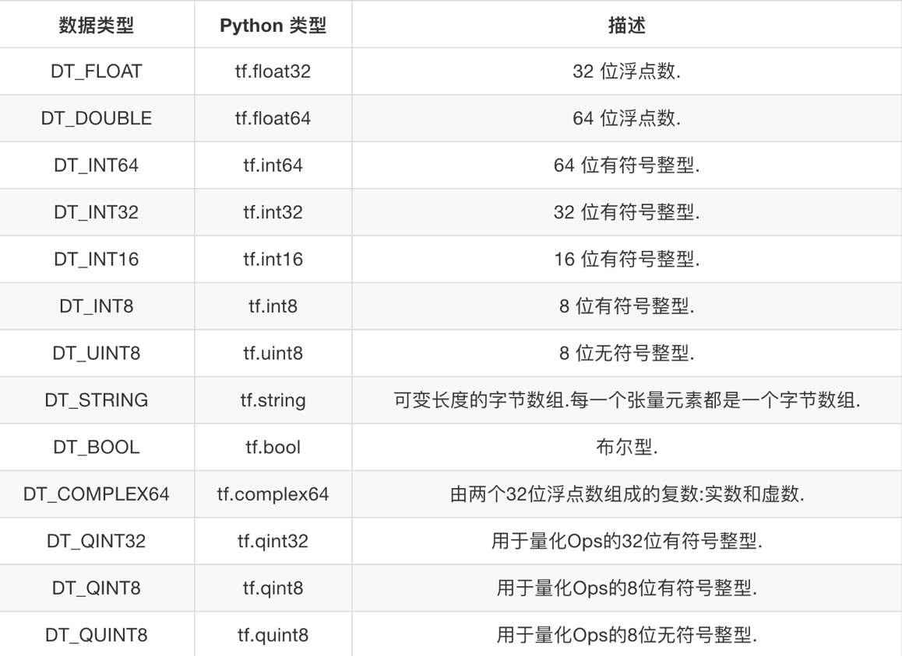
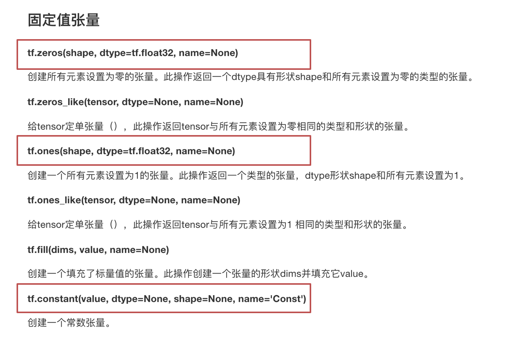
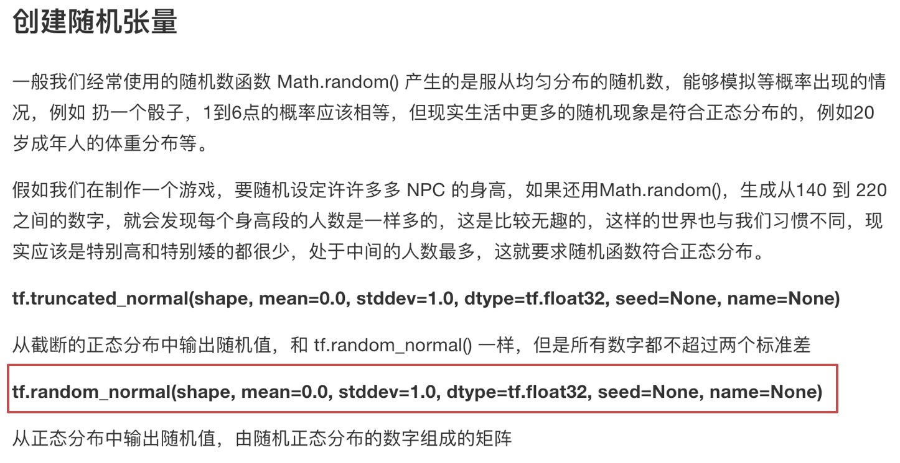
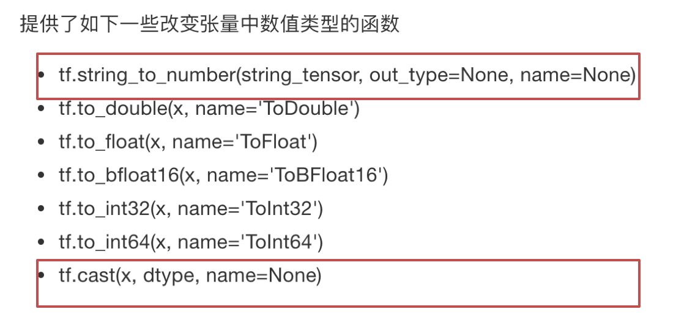

# 2.4. 张量

学习目标
----

*   目标
    *   知道常见的TensorFlow创建张量
    *   知道常见的张量数学运算操作
    *   说明numpy的数组和张量相同性
    *   说明张量的两种形状改变特点
    *   应用set_shape和tf.reshape实现张量形状的修改
    *   应用tf.matmul实现张量的矩阵运算修改
    *   应用tf.cast实现张量的类型
*   应用
    *   无
*   内容预览
    *   2.4.1 张量(Tensor)
        *   1 张量的类型
        *   2 张量的阶
    *   2.4.2 创建张量的指令
        *   固定值张量
        *   随机值张量
    *   2.4.3 张量的变换
        *   1 类型改变
        *   2 形状改变
    *   2.4.4 张量的数学运算

在编写 TensorFlow 程序时，程序传递和运算的主要目标是tf.Tensor

2.4.1 张量(Tensor)
----------------

TensorFlow 的张量就是一个 n 维数组， 类型为tf.Tensor。Tensor具有以下两个重要的属性

*   type:数据类型
*   shape:形状(阶)

### 1 张量的类型



### 2 张量的阶


形状有0阶、1阶、2阶….

```python
tensor1 = tf.constant(4.0)
tensor2 = tf.constant([1, 2, 3, 4])
linear_squares = tf.constant([[4], [9], [16], [25]], dtype=tf.int32)

print(tensor1.shape)
# 0维：()   1维：(10, )   2维：(3, 4)   3维：(3, 4, 5)
```


2.4.2 创建张量的指令
-------------

*   固定值张量



*   随机值张量



*   其它特殊的创建张量的op
    *   **tf.Variable**
    *   tf.placeholder

2.4.3 张量的变换
-----------

### 1 类型改变



### 2 形状改变

TensorFlow的张量具有两种形状变换，动态形状和静态形状

*   tf.reshape
*   tf.set_shape

关于动态形状和静态形状必须符合以下规则

* 静态形状
  *   转换静态形状的时候，1-D到1-D，2-D到2-D，不能跨阶数改变形状
  *   对于已经固定的张量的静态形状的张量，不能再次设置静态形状

* 动态性状
  *   tf.reshape()动态创建新张量时，张量的元素个数必须匹配

  ```python
      # 能用set_shape就优先使用，不能用的话，使用reshape
      
      tensor1 = tf.constant([1, 2, 3, 4])
      ph = tf.placeholder(tf.float32, [None, 4])
      # tensor2 = tf.constant(11.0)
      
      # tensor1.set_shape([2, 2])  错误
      ph.set_shape([3, 4])
      
      new_tensor = tf.reshape(ph, [4, 3])
      
      print(ph, new_tensor)
      # 打印的形状,在定义数据的时候形状使用[]
      # 不确定的形状:（？， 4）
      
      with tf.Session() as sess:
      
          print(sess.run(tensor1))
  ```


2.4.4 张量的数学运算
-------------

*   算术运算符
*   基本数学函数
*   矩阵运算
*   reduce操作
*   序列索引操作

> 详细请参考: [https://www.tensorflow.org/versions/r1.8/api\_guides/python/math\_ops](https://www.tensorflow.org/versions/r1.8/api_guides/python/math_ops)
>
> 这些API使用，我们在使用的时候介绍，具体参考文档