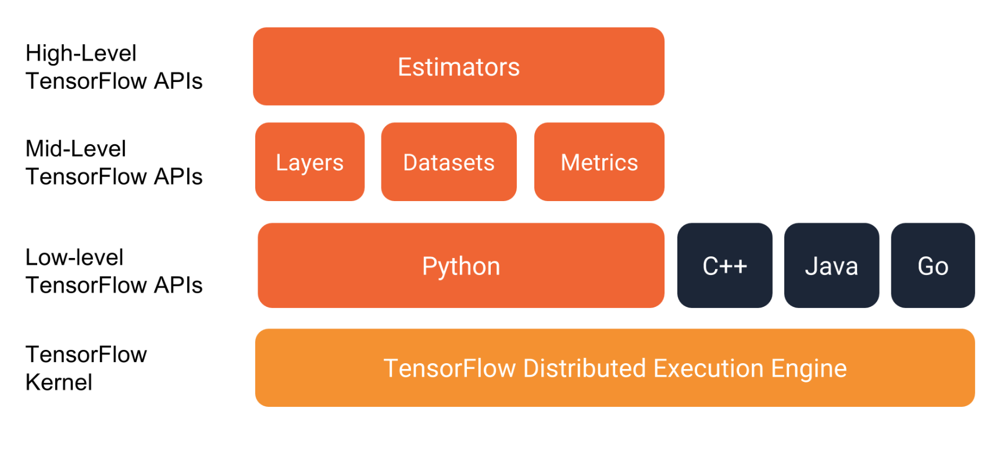

# 2.6. 高级API

学习目标
----

*   目标
    *   无
*   应用
    *   无
*   内容预览
    *   2.6.1 其它基础API
    *   2.6.2 高级API

2.6.1 其它基础API
-------------

1 tf.app
--------

这个模块相当于为 TensorFlow 进行的脚本提供一个 main 函数入口，可以定义脚本运行的 flags。

2 tf.image
----------

TensorFlow 的图像处理操作。主要是一些颜色变换、变形和图像的编码和解码。

3 tf.gfile
----------

这个模块提供了一组文件操作函数。

4 tf.summary
------------

用来生成 TensorBoard 可用的统计日志，目前 Summary 主要提供了 4 种类型：audio、image、histogram、scalar

5 tf.python_io
--------------

用来读写 TFRecords文件

6 tf.train
----------

这个模块提供了一些训练器，与 tf.nn 组合起来，实现一些网络的优化计算。

7 tf.nn
-------

这个模块提供了一些构建神经网络的底层函数。 TensorFlow 构建网络的核心模块。其中包含了添加各种层的函数，比如添加卷积层、池化层等。

2.6.2 高级API
-----------

1 tf.keras
----------

Keras 本来是一个独立的深度学习库，tensorflow将其学习过来，增加这部分模块在于快速构建模型。

2 tf.layers
-----------

高级 API，以更高级的概念层来定义一个模型。类似tf.keras。

3 tf.contrib
------------

tf.contrib.layers提供够将计算图中的 网络层、正则化、摘要操作、是构建计算图的高级操作，但是tf.contrib包含不稳定和实验代码，有可能以后API会改变。

4 tf.estimator
--------------

一个 Estimator 相当于 Model + Training + Evaluate 的合体。在模块中，已经实现了几种简单的分类器和回归器，包括：Baseline，Learning 和 DNN。这里的 DNN 的网络，只是全连接网络，没有提供卷积之类的。

关于TensorFlow的API图示
------------------

