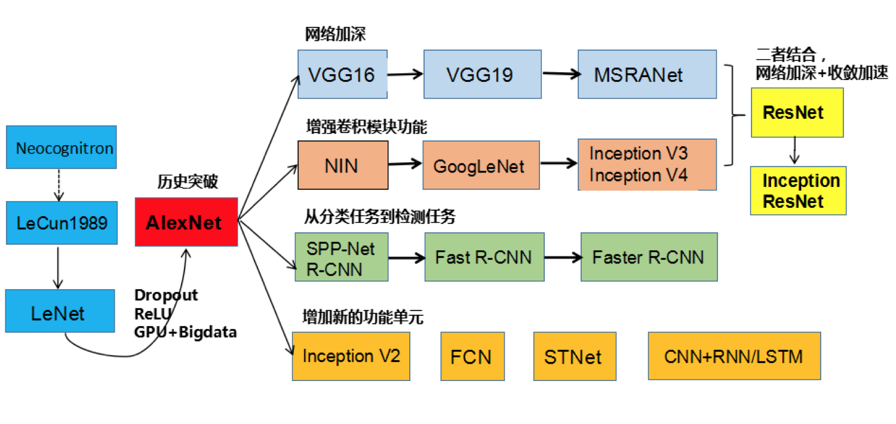
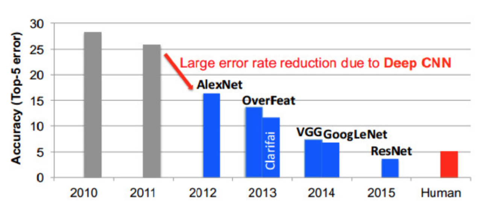

# 4.1. 卷积神经网络简介

学习目标
----

*   目标
    *   了解卷积神经网络的历史
*   应用
    *   无
*   内容预览
    *   4.1.1 卷积神经网络与传统多层神经网络对比
    *   4.1.2 卷积神经网络发展历史
    *   4.1.3 卷积网络ImageNet比赛错误率

随着人工智能需求的提升，我们想要做复杂的图像识别，做自然语言处理，做语义分析翻译等等，多层神经网络的简单叠加显然力不从心。

4.1.1 卷积神经网络与传统多层神经网络对比
-----------------------

*   传统意义上的多层神经网络是只有输入层、隐藏层、输出层。其中隐藏层的层数根据需要而定，没有明确的理论推导来说明到底多少层合适
*   卷积神经网络CNN，在原来多层神经网络的基础上，加入了更加有效的特征学习部分，具体操作就是在原来的全连接层前面加入了卷积层与池化层。**卷积神经网络出现，使得神经网络层数得以加深，“深度”学习由此而来。**

> 通常所说的深度学习，**一般指的是这些CNN等新的结构以及一些新的方法（比如新的激活函数Relu等）**，解决了传统多层神经网络的一些难以解决的问题

4.1.2 卷积神经网络发展历史
----------------

*   网络结构加深
*   加强卷积功能
*   从分类到检测
*   新增功能模块

4.1.3 卷积网络ImageNet比赛错误率
-----------------------

> ImageNet 可以说是计算机视觉研究人员进行大规模物体识别和检测时，最先想到的视觉大数据来源，最初由斯坦福大学李飞飞等人在 CVPR 2009 的一篇论文中推出，并被用于替代 PASCAL 数据集（后者在数据规模和多样性上都不如 ImageNet）和 LabelMe 数据集（在标准化上不如 ImageNet）。
>
> **ImageNet 不但是计算机视觉发展的重要推动者，也是这一波深度学习热潮的关键驱动力之一。**
>
> 截至 2016 年，ImageNet 中含有超过 1500 万由人手工注释的图片网址，也就是带标签的图片，标签说明了图片中的内容，超过 2.2 万个类别。

