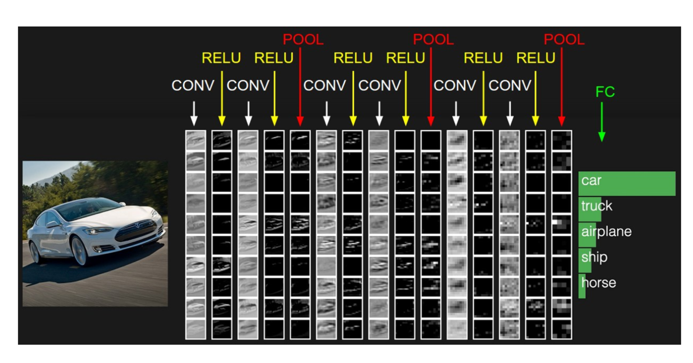

# 4.2. 卷积神经网络原理

学习目标
----

*   目标
    *   说明卷积神经网络的三个结构
    *   说明卷积层的卷积核个数、大小、步长以及零填充参数作用
    *   说明激活函数种类以及在神经网络中的作用
    *   说明池化层的大小、步长参数的作用
    *   记忆卷积、池化层的输出大小以及零填充计算公式
    *   说明全连接层在卷机网络中的作用
*   应用
    *   无
*   内容预览
    *   4.2.1 卷积神经网络三个结构
    *   4.2.2 卷积层
        *   1 卷积核(Filter)的四大要素
        *   2 卷积如何计算-大小
        *   3 卷积如何计算-步长
        *   4 卷积如何计算-卷积核个数
        *   5 卷积如何计算-零填充大小
        *   6 总结-输出大小计算公式
        *   7 多通道图片如何观察
        *   8 卷积网络API
    *   4.2.3 激活函数
        *   1 Relu
        *   2 playground演示不同激活函数作用
        *   3 为什么采取的新的激活函数
        *   4 激活函数API
    *   4.2.4 池化层(Polling)
        *   1 池化层计算
        *   2 池化层API
    *   4.2.5 全连接层(Full Connection)

#### 卷积神经网络的结构是怎样的？

4.2.1 卷积神经网络三个结构
----------------

神经网络(neural networks)的基本组成包括输入层、隐藏层、输出层。而卷积神经网络的特点在于隐藏层分为卷积层和池化层(pooling layer，又叫下采样层)以及激活层。每一层的作用

*   卷积层：通过在原始图像上平移来提取特征
*   激活层：增加非线性分割能力
*   池化层：减少学习的参数，降低网络的复杂度（最大池化和平均池化）

为了能够达到分类效果，还会有一个全连接层(Full Connection)也就是最后的输出层，进行损失计算并输出分类结果。

4.2.2 卷积层（Convolutional Layer）
------------------------------

**卷积神经网络中每层卷积层由若干卷积单元(卷积核)组成**，每个卷积单元的参数都是通过反向传播算法最佳化得到的。

**卷积运算的目的是特征提取，第一层卷积层可能只能提取一些低级的特征如边缘、线条和角等层级，更多层的网络能从低级特征中迭代提取更复杂的特征。**

### 1 卷积核(Filter)的四大要素

*   卷积核个数
*   卷积核大小
*   卷积核步长
*   卷积核零填充大小

#### 接下来我们通过计算案例讲解，假设图片是黑白图片（只有一个通道）

### 2 卷积如何计算-大小

卷积核我们可以理解为一个观察的人，**带着若干权重和一个偏置**去观察，进行特征加权运算。

> 注：上述要加上偏置

*   卷积核大小
    *   1\*1、3\*3、5*5

**通常卷积核大小选择这些大小，是经过研究人员实验证明比较好的效果。**这个人观察之后会得到一个运算结果，

那么这个人想观察所有这张图的像素怎么办？那就需要平移：

### 3 卷积如何计算-步长

需要去平移卷积核观察这张图片，需要的参数就是**步长**。

##### 假设移动的步长为一个像素，那么最终这个人观察的结果以下图为例：

*   5x5的图片，3x3的卷积大小去**一个**步长运算得到3x3的大小观察结果

##### 如果移动的步长为2那么结果是这样

*   5x5的图片，3x3的卷积大小去**2个**步长运算得到2x2的大小观察结果

### 4 卷积如何计算-卷积核个数

那么如果在某一层结构当中，不止是一个人观察，多个人(卷积核)一起去观察。那就得到多张观察结果。

*   不同的卷积核带的权重和偏置都不一样，即随机初始化的参数

##### 我们已经得出输出结果的大小由大小和步长决定的，但是只有这些吗？

##### 还有一个就是零填充。Filter观察窗口的大小和移动步长有时会导致超过图片像素宽度！

### 5 卷积如何计算-零填充大小

零填充就是在图片像素外围填充一圈值为0的像素。

### 6 总结-输出大小计算公式

如果已知输入图片形状，卷积核数量，卷积核大小，以及移动步长，那么输出图片形状如何确定？

通过一个例子来理解下面的公式

> 计算案例：
>
> 1、假设已知的条件：输入图像32\*32\*1, 50个Filter，大小为5*5，移动步长为1，零填充大小为1。请求出输出大小？
>
> H2 = (H1 - F + 2P)/S + 1 = (32 - 5 + 2 * 1)/1 + 1 = 30
>
> W2 = (H1 - F + 2P)/S + 1 = (32 -5 + 2 * 1)/1 + 1 = 30
>
> D2 = K = 50
>
> 所以输出大小为\[30, 30, 50\]
>
> 2、假设已知的条件：输入图像32\*32\*1, 50个Filter，大小为3\*3，移动步长为1，未知零填充。输出大小32\*32？
>
> H2 = (H1 - F + 2P)/S + 1 = (32 - 3 + 2 * P)/1 + 1 = 32
>
> W2 = (H1 - F + 2P)/S + 1 = (32 -3 + 2 * P)/1 + 1 = 32
>
> 所以零填充大小为：1*1

### 7 多通道图片如何观察

如果是一张彩色图片，那么就有三种表分别为R，G，B。**原本每个人需要带一个3x3或者其他大小的卷积核，现在需要带3张3x3的权重和一个偏置，总共就27个权重。**最终每个人还是得出一张结果：

### 8 卷积网络API

* tf.nn.conv2d(input, filter, strides=, padding=, name=None)

  *   计算给定4-D input和filter张量的2维卷积
  *   input：给定的输入张量，具有\[batch,heigth,width,channel\]，类型为float32,64
  *   filter：指定过滤器的权重数量，\[filter\_height, filter\_width, in\_channels, out\_channels\]
  *   strides：strides = \[1, stride, stride, 1\],步长
  *   padding：“SAME”, “VALID”，具体解释见下面。
* Tensorflow的零填充方式有两种方式，SAME和VALID

  *   SAME：越过边缘取样，取样的面积和输入图像的像素宽度一致。公式 : ceil(HS) ceil(\\frac{H}{S}) ceil(SH)
      *   H 为输入的图片的高或者宽，S为步长。
      *   无论过滤器的大小是多少，零填充的数量由API自动计算。
  *   VALID：不越过边缘取样，取样的面积小于输入人的图像的像素宽度。不填充。

  > 在Tensorflow当中，卷积API设置”SAME”之后，如果步长为1，输出高宽与输入大小一样（重要）

### 9 小结

*   1 已知固定输出大小，反过来求出零填充，已知零填充，根据步长等信息，求出输出大小
*   2 卷积层过滤器(卷积核)大小，三个选择1x1，3x3，5x5，步长一般都为1，过滤器个数不定，不同结构选择不同。
*   3 每个过滤器会带有若干权重和1个偏置

4.2.3 激活函数
----------

随着神经网络的发展，大家发现原有的sigmoid等激活函数并不能达到好的效果，所以采取新的激活函数。

### 1 Relu

效果是什么样的呢？

### 2 playground演示不同激活函数作用

网址：[http://playground.tensorflow.org/](http://playground.tensorflow.org/)

*   Relu
*   Tanh
*   sigmoid

### 3 为什么采用新的激活函数

*   Relu优点
    *   有效解决梯度爆炸问题
    *   计算速度非常快，只需要判断输入是否大于0。SGD(批梯度下降)的求解速度速度远快于sigmoid和tanh
*   sigmoid缺点
    *   采用sigmoid等函数，计算量相对大，而采用Relu激活函数，整个过程的计算量节省很多。在深层网络中，sigmoid函数 反向传播 时，很容易就会出现梯度消失的情况

### 4 激活函数API

*   tf.nn.relu(features, name=None)
    *   features:卷积后加上偏置的结果
    *   return:结果

4.2.4 池化层(Polling)
------------------

Pooling层主要的作用是特征提取，通过去掉Feature Map中不重要的样本，进一步减少参数数量。Pooling的方法很多，通常采用最大池化

*   max_polling:取池化窗口的最大值
*   avg_polling:取池化窗口的平均值

### 1 池化层计算

**池化层也有窗口的大小以及移动步长，那么之后的输出大小怎么计算？计算公式同卷积计算公式一样**

> 计算：224x224x64,窗口为2，步长为2输出结果？
>
> H2 = (224 - 2 + 2*0)/2 +1 = 112
>
> w2 = (224 - 2 + 2*0)/2 +1 = 112

通常池化层采用 2x2大小、步长为2窗口

### 2 池化层API

*   tf.nn.max_pool(value, ksize=, strides=, padding=,name=None)
    *   输入上执行最大池数
    *   value：4-D Tensor形状\[batch, height, width, channels\]
    *   channel：并不是原始图片的通道数，而是多少filter观察
    *   ksize：池化窗口大小，\[1, ksize, ksize, 1\]
    *   strides：步长大小，\[1,strides,strides,1\]
    *   padding：“SAME”， “VALID”，使用的填充算法的类型，默认使用“SAME”

4.2.5 全连接层(Full Connection)
---------------------------

**前面的卷积和池化相当于做特征工程，最后的全连接层在整个卷积神经网络中起到“分类器”的作用。**

4.2.6 卷积神经网络总结
--------------

4.2.7 面试题练习
-----------

答案：C