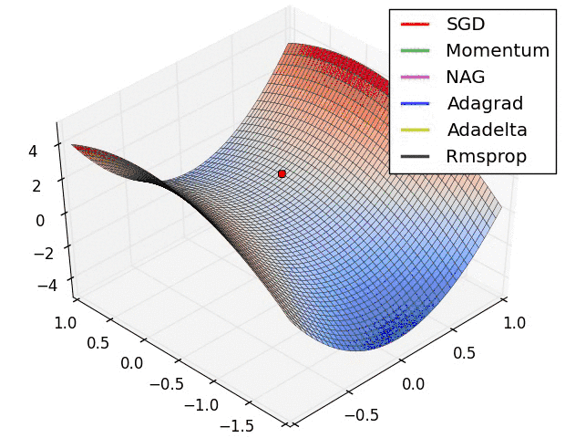
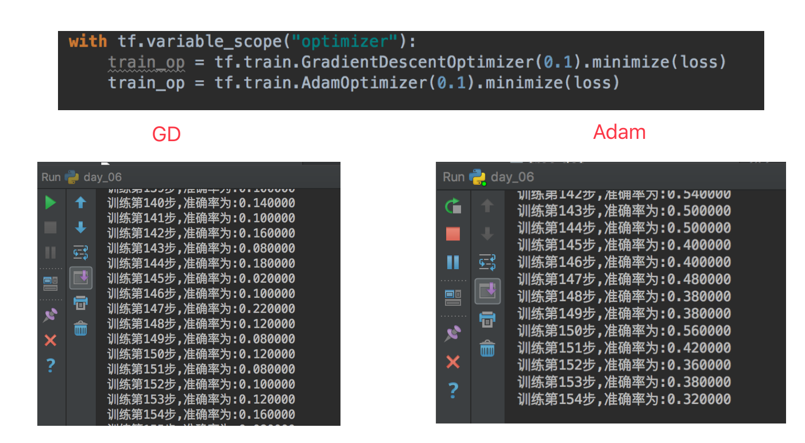
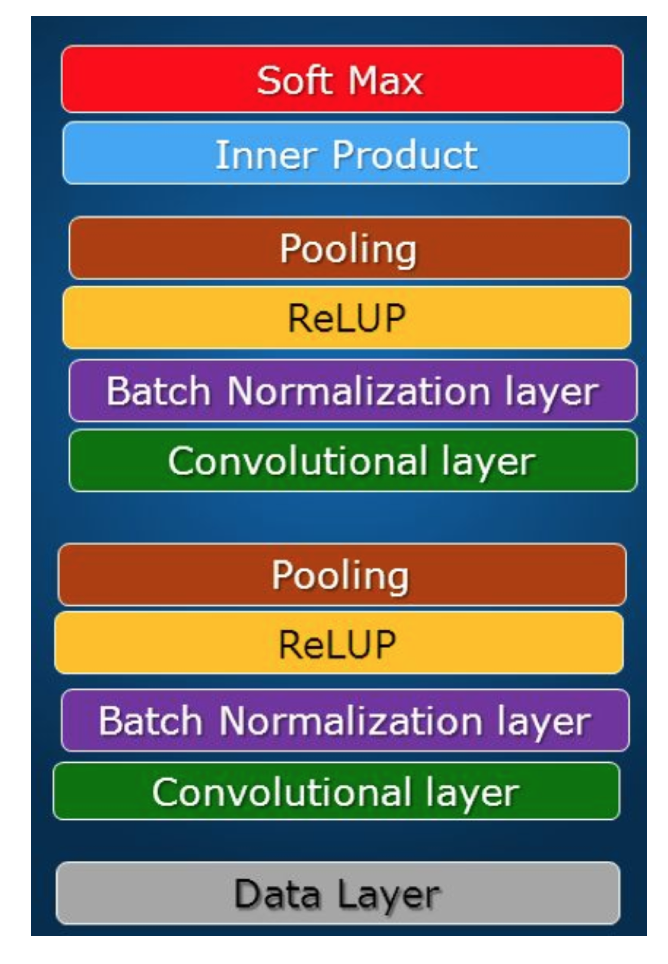
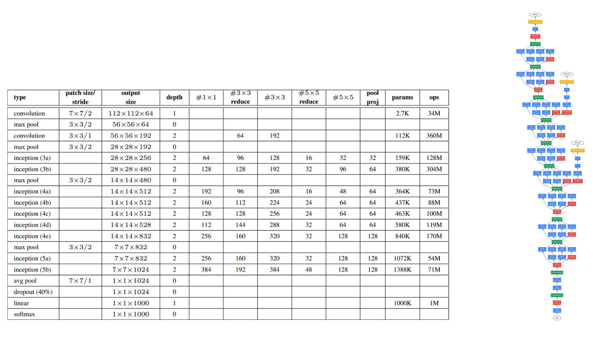
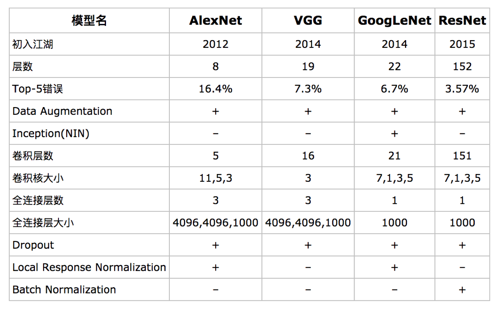

# 4.4. 网络结构与优化

*   目标
    *   了解梯度下降优化的改进版Adam优化器
    *   知道使用Batch Normalization归一化防止网络过拟合
    *   了解Droupout层的作用
*   应用
    *   无
*   内容预览
    *   4.4.1 网络的优化和改进
        *   1 改变权重参数大小
        *   2 梯度下降不同优化版本
        *   3 使用Adam优化器对比
        *   4 深度网络使用Batch Normalization层
    *   4.4.2 卷积神经网络的拓展了解
        *   1 常见网络模型
        *   2 卷积网络其它用途

梯度下降优化器容易发生梯度爆炸现象，所以通常对于深度学习来说回去使用改进版本的优化器，如Adam优化等

4.4.1 网络的优化和改进
--------------

*   初始参数大小调整

    *   模型参数的大小缩小
*   使用改进版SGD算法

*   对于深度网络使用batch normalization或者droupout层

### 1 改变权重参数大小

    # 封装两个初始化参数的API，以变量Op定义
    def weight_variables(shape):
        w = tf.Variable(tf.random_normal(shape=shape, mean=0.0, stddev=0.1))
        return w

​    
    def bias_variables(shape):
        b = tf.Variable(tf.random_normal(shape=shape, mean=0.0, stddev=0.1))
        return b

### 2 梯度下降不同优化版本

先来看一张图

最朴素的优化算法就是SGD了，梯度下降算法效果也很好，但也存在一些问题选择一个合理的学习速率很难。容易陷入那些次优的局部极值点中

> 拓展内容（了解）：
>
> *   **SGD with Momentum**
>
> **梯度更新规则:**Momentum在梯度下降的过程中加入了惯性，使得梯度方向不变的维度上速度变快，梯度方向有所改变的维度上的更新速度变慢，这样就可以加快收敛并减小震荡。
>
> *   **RMSProp**
>
> **梯度更新规则:**解决Adagrad学习率急剧下降的问题，RMSProp改变了二阶动量计算方法，即用窗口滑动加权平均值计算二阶动量。
>
> *   **Adam**
>
> **梯度更新规则:**Adam = Adaptive + Momentum，顾名思义Adam集成了SGD的一阶动量和RMSProp的二阶动量。

### 3 使用Adam优化器对比

### 4 深度网络使用Batch Normalization层

*   目的：提高网络泛化能力，防止过拟合
    *   BN(Batch Normalization)也属于网络的一层，又称为归一化层。

> 注：在一些大型网络当中使用Droupout，使得部分比例神经元失效

4.4.2 卷积神经网络的拓展了解
-----------------

### 1 常见网络模型

*   GoogleNet

卷积网络结构在imagenet比赛对比

* TensorFlow网络模型API

  from tensorflow.contrib.slim.python.slim.nets.inception_v3 import inception_v3_base

### 2 卷积网络其它用途

*   图像目标检测
    *   Yolo：GoogleNet+ bounding boxes
    *   SSD：VGG + region proposals
    *   Faster-RCNN: VGG, ResNet

