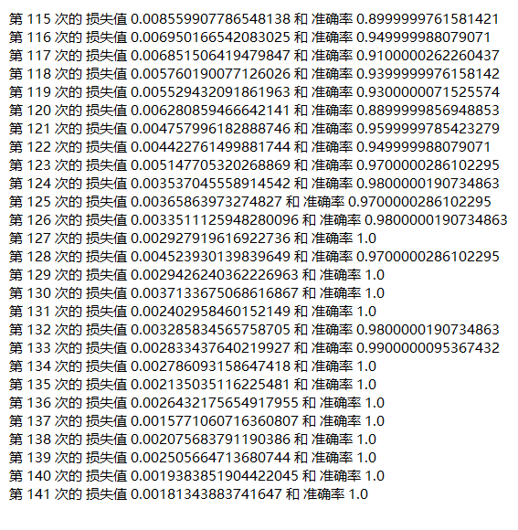
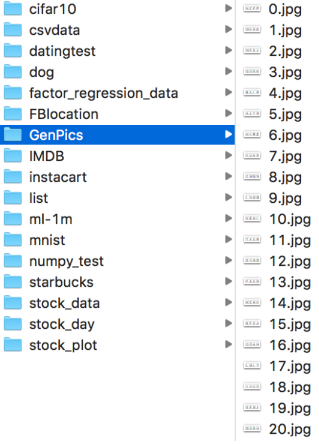
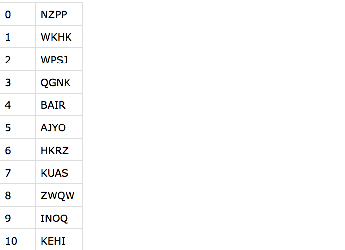
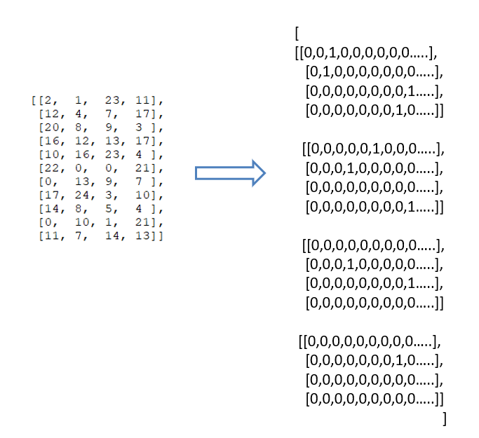
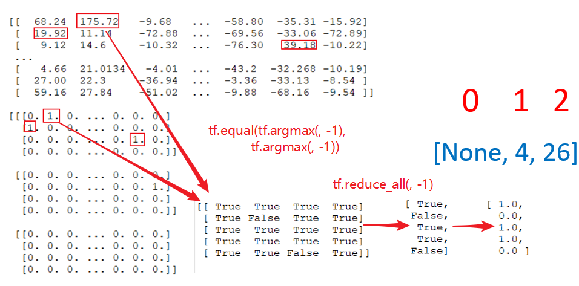

# 4.5. 实战：验证码图片识别

*   目标
    *   说明验证码识别的原理
    *   说明全连接层的输出设置
    *   说明输出结果的损失、准确率计算
    *   说明验证码标签值的数字转换
    *   应用tf.one\_hot实现验证码目标值的one\_hot编码处理
*   应用
    *   应用神经网络识别验证码图片
*   内容预览
    *   4.5.1 训练效果
    *   4.5.2 验证码识别实战
        *   1 原始图片数据和标签值
        *   2 标签值处理分析
        *   3 原理分析
            *   如何比较输出结果和真实值的正确性？
            *   如何衡量损失？
            *   准确率如何计算？
        *   4 代码实现
    *   4.5.3 完整训练代码
    *   4.5.4 拓展

4.5.1 训练效果
----------

4.5.2 验证码识别实战
-------------

*   用文件队列实现原始数据读取
*   设计网络结构
    *   网络的输出处理
*   训练模型并预测

### 1 原始图片数据和标签值

一共有6000张验证码图片，标签值为验证码图片所包含的4个字母，以图片文件名为索引存放在labels.csv文件中。

labels.csv文件内容

### 2 标签值处理分析

每个图片的标签值都是一个字符串，将其当做一个个的字符单独处理。一张验证码的图片的目标值由4个数字组成，可以建立这样的对应关系

    "ABCDEFGHIJKLMNOPQRSTUVWXYZ"
    0,1,2,................,24,25
    
    最终：
    "NZPP"----> [[13, 25, 15, 15]]

在代码中维护一个pandas DataFrame数据类型的表格，方便根据每个图片的文件名查询每个图片的标签值。

          chars      labels
    index                        
    0      NZPP  [13, 25, 15, 15]
    1      WKHK   [22, 10, 7, 10]
    2      WPSJ   [22, 15, 18, 9]
    3      QGNK   [16, 6, 13, 10]
    4      BAIR     [1, 0, 8, 17]
    5      AJYO    [0, 9, 24, 14]
    6      HKRZ   [7, 10, 17, 25]
    7      KUAS   [10, 20, 0, 18]
    8      ZWQW   [25, 22, 16, 22]
    9      INOQ   [8, 13, 14, 16]
    ...

### 3 原理分析

*   **如何比较输出结果和真实值的正确性？**

可以对每个位置进行one_hot编码

考虑每个位置的可能性？"ABCDEFGHIJKLMNOPQRSTUVWXYZ"

第一个位置：26种可能性

第二个位置：26种可能性

第三个位置：26种可能性

第四个位置：26种可能性

按照这样的顺序，"ABCDEFGHIJKLMNOPQRSTUVWXYZ"

    真实值：
    第一个位置：[0,0,0,0,0,0,0,0,0,0,0,0,0,0,1,0,0,0,0,0,0,0,0,0,0,0]
    第二个位置：[0,0,0,0,0,0,0,0,0,0,0,0,0,0,0,0,0,0,0,0,0,0,0,0,0,1]
    第三个位置：[0,0,0,0,0,0,0,0,0,0,0,0,1,0,0,0,0,0,0,0,0,0,0,0,0,0]
    第四个位置：[0,0,0,0,0,0,0,0,0,0,0,0,1,0,0,0,0,0,0,0,0,0,0,0,0,0]

那么每个验证码的目标有\[4, 26\]这样一个数组''

*   **如何衡量损失？**

我们考虑将目标值拼接在一起，形成一个\[104\]长度的一阶张量

    真实值：
    [0,0,0,0,...0,0,1,0,0][0,0,0,1,...0,0,0,0,0][0,0,0,0,...0,0,0,1,0][1,0,0,0,...0,0,0,0,0]
              26                    26                   26                     26
    
    预测概率值：
    [0.001,0.01,,...,0.2,][0.001,0.01,,...,0.2,][0.001,0.01,,...,0.2,][0.02,0.01,,...,0.1,]
              26                    26                   26                     26

如果计算预测概率值时仍然使用softmax函数，并对这两个104个元素的一阶张量计算交叉熵损失，会存在损失值过大并且无法减小的问题。

由于softmax针对所有104个输出的logits计算输出概率，和为1，最好的结果是真实值编码为1的4个位置对应的预测概率值为0.25。在迭代优化过程中，如果要使其概率进一步提供，势必造成其他三个真实值编码为1的位置对应的概率值下降。

sotfmax交叉熵适合于计算**类别相互排斥**的离散分类任务的损失值，每个输出对应一个类别。

比如CIFAR-10图像都标**有一个且仅有一个标签**，只能是10个类别中的一种。

但如果遇到需要预测4个真实结果的情况，我们就需要使用sigmoid交叉熵计算损失。

sigmoid交叉熵适合计算**每个类别独立且不互相排斥**的离散分类任务中的损失值。

例如，可以执行**多标签分类**，其中图片可以同时包含大象和狗。

sigmoid函数计算104个类别的每一个类别的概率值，针对每一个输出计算交叉熵。设y为标签值，y‾ \\overline{y} y 为输入sigmoid之前的logits值。计算公式为： loss=−y∗log(sigmoid(y‾))−(1−y)∗log(sigmoid(1−y‾)) loss = - y * log(sigmoid(\\overline{y})) - (1-y)*log(sigmoid(1-\\overline{y})) loss=−y∗log(sigmoid(y))−(1−y)∗log(sigmoid(1−y)) 和逻辑回归的对数似然损失函数是一样的，这里需要对104个输出都计算损失。

_sigmoid交叉熵损失函数_

      tf.nn.sigmoid_cross_entropy_with_logits(labels=None, logits=None, name=None)
          labels: 真实值，为one_hot编码形式，和logits一样的形状。
          logits: logits值，输出层的加权计算结果。

_对真实值进行one_hot编码_

      tf.one_hot(indices, depth, axis=None, name=None)
          indices: 需要编码的张量
          depth: one_hot编码的深度。我们这个例子里是26。
          axis: 填充的维度，默认是-1。

预测值和目标值形状要变为\[None, 4, 26\]

*   **准确率如何计算？**

**在每个验证码的第三个维度去进行比较，4个标签的目标值位置与预测概率位置是否相等，4个全相等，这个样本才预测正确**

    维度位置比较：
        0   1   2
    [None, 4, 26]
    
    tf.argmax(y_predict, 2)

### 4 代码实现：

1）解析CSV文件, 建立文件名和标签值对应表格

    def parse_csv():
    
        # 解析CSV文件, 建立文件名和标签值对应表格
    
        csv_data = pd.read_csv("./GenPics/labels.csv", names=["file_num", "chars"], index_col="file_num")
    
        labels = []
        for label in csv_data["chars"]:
            tmp = []
            for letter in label:
                tmp.append(ord(letter) - ord("A"))
            labels.append(tmp)
    
        csv_data["labels"] = labels

​    
        return csv_data

返回结果：

chars

labels

file_num

0

NZPP

\[13, 25, 15, 15\]

1

WKHK

\[22, 10, 7, 10\]

2

WPSJ

\[22, 15, 18, 9\]

3

QGNK

\[16, 6, 13, 10\]

4

BAIR

\[1, 0, 8, 17\]

5

AJYO

\[0, 9, 24, 14\]

6

HKRZ

\[7, 10, 17, 25\]

……

……

……

2）读取图片数据

按照文件读取流程进行读取，和之间的区别在于，读取器同时返回了文件名和图片内容。文件名会一并返回作为查询具体的标签值的索引。

    def read_pic(file_list):
    
        # 1、构造文件名队列
        file_queue = tf.train.string_input_producer(file_list)
    
        # 2、读取与解码
        reader = tf.WholeFileReader()
        filename, value = reader.read(file_queue)
        print("value:\n", value)
    
        image = tf.image.decode_jpeg(value)
        print("image:\n", image)
        image.set_shape([20, 80, 3])

​    
        # 3、批处理
        filename_batch, image_batch = tf.train.batch([filename, image], batch_size=100, num_threads=2, capacity=200)
    
        return filename_batch, image_batch

3）将标签值的字母转为0~25的数字

训练中读取每个图片时会获得每个图片的文件名，需要对应得到标签值数据

    def filename2label(filenames, csv_data):
        labels = []
        for filename in filenames:
            file_num = "".join(list(filter(str.isdigit, str(filename))))
            labels.append(csv_data.loc[int(file_num), "labels"])
    
        return np.array(labels)

返回的结果

    [[24  9 25 18]
     [ 9 16 20  5]
     [15 10  6  2]
     [ 2 20  2  9]
     [14  2 23  7]
     ...
     [ 5 12  9 22]
     [ 3 16  3 18]
     [17 15 16 12]]

4）建立卷积神经网络模型

模型的结构和之前的mnist手写字识别是一样的，由两个卷积层和一个全连接输出层组成。

    def create_variable(shape):
        return tf.Variable(tf.random_normal(shape=shape, stddev=0.01))
    
    def create_cnn_model(x):
    
        with tf.variable_scope("conv1"):
            # 卷积层
            # conv1_weights = tf.Variable(tf.random_normal(shape=[5, 5, 1, 32]))
            conv1_weights = create_variable([5, 5, 3, 32])
            # conv1_bias = tf.Variable(tf.random_normal(shape=[32]))
            conv1_bias = create_variable([32])
            conv1_tensor = tf.nn.conv2d(x, conv1_weights, strides=[1, 1, 1, 1], padding="SAME") + conv1_bias
    
            # 激活层
            relu1_tensor = tf.nn.relu(conv1_tensor)
    
            # 池化层
            pool1_tensor = tf.nn.max_pool(relu1_tensor, ksize=[1, 2, 2, 1], strides=[1, 2, 2, 1], padding="SAME")
    
            # [None, 20, 80, 3] --> [None, 10, 40, 32]
    
        with tf.variable_scope("conv2"):
            # 卷积层
            # conv1_weights = tf.Variable(tf.random_normal(shape=[5, 5, 1, 32]))
            conv2_weights = create_variable([5, 5, 32, 64])
            # conv1_bias = tf.Variable(tf.random_normal(shape=[32]))
            conv2_bias = create_variable([64])
            conv2_tensor = tf.nn.conv2d(pool1_tensor, conv2_weights, strides=[1, 1, 1, 1], padding="SAME") + conv2_bias
    
            # 激活层
            relu2_tensor = tf.nn.relu(conv2_tensor)
    
            # 池化层
            pool2_tensor = tf.nn.max_pool(relu2_tensor, ksize=[1, 2, 2, 1], strides=[1, 2, 2, 1], padding="SAME")
    
            # [None, 10, 40, 32] --> [None, 5, 20, 64]
    
        with tf.variable_scope("fc"):
            # [-1, 7 * 7 * 64] * [7 * 7 * 64, 10] = [None, 10]
            # [-1, 5 * 20 * 64] * [5 * 20 * 64， 4 * 26] = [None, 4 * 26]
            fc_x = tf.reshape(pool2_tensor, [-1, 5 * 20 * 64])
    
            fc_weights = create_variable([5 * 20 * 64, 4 * 26])
            fc_bias = create_variable([4 * 26])
            #
            # # y_predict (None, 10)
            y_predict = tf.matmul(fc_x, fc_weights) + fc_bias
    
        return y_predict

5）计算sigmoid交叉熵损失

每个图片的104个预测概率与104个真实值之间进行交叉熵计算

    # 计算sigmoid交叉熵损失
    loss = tf.reduce_mean(tf.nn.sigmoid_cross_entropy_with_logits(labels=y_true, logits=y_predict))

6）优化

调用Adam梯度下降算法进行优化，相比随机梯度下降，Adam优化速度快很多，但是需要设置更小的学习率。

    # optimizer = tf.train.GradientDescentOptimizer(0.01).minimize(loss)
    optimizer = tf.train.AdamOptimizer(0.001).minimize(loss)

7）计算准确率

在计算准确率时，只有每个图片的四个值都为真时，这一个样本的值才为真。

* y_true和logits都是\[100, 104\]的二阶张量，需要转换为\[100, 4, 26\]的三阶张量。

* 调用tf.argmax()求得最大值的位置

* 调用tf.equal()比较，得到二阶逻辑张量。

* 通过tf.reduce_all(tensor, axis=-1)，当4个全为真时样本结果为真。

  

  # 计算准确率
  equal_list = tf.reduce_all(
  ​        tf.equal(
  ​            tf.argmax(tf.reshape(y_predict, [-1, 4, 26]), axis=-1),
  ​            tf.argmax(tf.reshape(y_true, [-1, 4, 26]), axis=-1)), axis=1)
  accuracy = tf.reduce_mean(tf.cast(equal_list, tf.float32))

8）模型训练

开启会话进行模型训练的步骤

* 初始化全局变量
* 由于有文件读取队列，需要启动线程
* 迭代读取图片，训练模型
  *   读取图片和文件名
  *   调用filenames\_2\_labels把文件名转换为标签值
  *   对标签值进行one_hot编码
  *   用图片和标签值进行训练
* 停止队列

  # 开启会话
  with tf.Session() as sess:
  ​    sess.run(init)

      coord = tf.train.Coordinator()
      
      threads = tf.train.start_queue_runners(sess=sess, coord=coord)
      
      for i in range(1000):
          filenames, images = sess.run([filename_batch, image_batch])
          labels = filename2label(filenames, csv_data)
          labels_onehot = tf.reshape(tf.one_hot(labels, 26), [-1, 4*26]).eval()
          _, loss_value, accuracy_value= sess.run([optimizer, loss, accuracy], feed_dict={x: images, y_true: labels_onehot})
          print("第%d次损失为%f, 准确率为%f" % (i+1, loss_value, accuracy_value))
      
          coord.request_stop()
          coord.join(threads)

4.5.3 完整训练代码
------------

    import pandas as pd
    import numpy as np
    import glob
    import random
    import tensorflow as tf
    import os
    
    os.environ['TF_CPP_MIN_LOG_LEVEL'] = '2'
    
    tf.app.flags.DEFINE_integer('batch_size', 100, '每批次的样本数量')
    tf.app.flags.DEFINE_integer('capacity', 200, '批处理队列大小')
    FLAGS = tf.app.flags.FLAGS
    
    def parse_csv():
        """
        解析CSV文件, 建立文件名和标签值对应表格
        :return: None
        """
    
        # 读取 csv标签文件
        csv_data = pd.read_csv('./data/GenPics/labels.csv', names=['index', 'chars'], index_col='index')
        # print(csv_data)
    
        # 增加lables列
        csv_data['labels'] = None
    
        # 把字母转换成标签值 A -> 0, B -> 1, ... Z -> 25
        for i, row in csv_data.iterrows():
            labels = []
            # 每一个字母转换为数字标签
            for char in row['chars']:
                # 每个字母的ascii 值 和 'A' 相减
                labels.append(ord(char) - ord('A'))
    
            # 把标签值添加到 表格中
            csv_data.loc[i, 'labels'] = labels
    
        return csv_data

​    
    def filenames_2_labels(filenames, csv_data):
        """
        文件名转换为 标签值
        :param filenames: 多个文件名的数组
        :param csv_data: 包含文件名和标签值的表格
        :return: 标签值
        """
        # 获得文件名
        labels = []
        for file in filenames:
            index, _ = os.path.splitext(os.path.basename(file))
            # 根据文件名查找标签值, 添加到 标签值列表
            labels.append(csv_data.loc[int(index), 'labels'])
    
        return np.array(labels)

​    
    def pic_read(files):
        """
        文件队列读取图片
        :return: 图片和文件名
        """
        # 创建文件名队列
        filename_queue = tf.train.string_input_producer(files)
    
        # 创建读取器, 读取图片。
        # 返回的第一个值为文件名
        # 第二个值为图片内容
        filename, value = tf.WholeFileReader().read(filename_queue)
    
        # 对图片进行解码
        image = tf.image.decode_jpeg(value)
        print('image:', image)
    
        # 设置形状，由于不改变张量的阶，所以可以直接调用张量的set_shape,
        # 不需要调用tf.reshape
        image.set_shape([20, 80, 3])
    
        # 建立批处理对列
        image_batch, filename_batch = tf.train.batch([image, filename],
                batch_size=FLAGS.batch_size, num_threads=2, capacity=FLAGS.capacity)
    
        return image_batch, filename_batch

​    
    def weight_var(shape, name=None):
        return tf.Variable(tf.truncated_normal(shape, mean=0.0, stddev=0.01, dtype=tf.float32), name=name)

​    
    def bias_var(shape, name=None):
        return tf.Variable(tf.zeros(shape, dtype=tf.float32), name=name)

​    
    def create_cnn_model():
        """
        创建卷积神经网络模型, 两个大的卷积层和一个全连接层
        :return: x, y_true, logits
        """
        # 定义数据占位符
        with tf.variable_scope('data'):
            x = tf.placeholder(tf.float32, [None, 20, 80, 3])
            y_true = tf.placeholder(tf.float32, [None, 4*26])
    
        # 卷积大层1: 卷积层, 激活函数, 池化层
        with tf.variable_scope('conv1'):
            # 卷积层: 输入: [None, 20, 80, 3]
            # 过滤器: size=[3,3], in_channel: 3, out_channels: 32, strides=1*1, padding='SAME'
            # 权重变量形状: [3, 3, 3, 32]
            # 输出的形状: [None, 20, 80, 32]
            w_conv1 = weight_var([3,3,3,32], name='w_conv1')
            b_conv1 = bias_var([32], name='b_conv1')
    
            x_conv1 = tf.nn.conv2d(x, filter=w_conv1, strides=[1, 1, 1, 1],
                                   padding='SAME', name= 'conv1_2d') + b_conv1
    
            # 激活函数
            x_relu1 = tf.nn.relu(x_conv1, name='relu1')
    
            # 池化层: 输入形状 [None, 20, 80, 32]
            # kszie=[1, 2, 2, 1], stride =[1, 2, 2, 1]
            # 输出形状 [None, 10, 40 ,32]
            x_pool1 = tf.nn.max_pool(x_relu1, ksize=[1,2,2,1], strides=[1, 2, 2, 1], padding='SAME', name='pool1')
    
        # 卷积大层2: 卷积层, 激活函数, 池化层
        with tf.variable_scope('conv2'):
            # 卷积层: 输入: [None, 10, 40, 32]
            # 过滤器: size=[3,3], in_channel: 32, out_channels: 64, strides=1*1, padding='SAME'
            # 权重变量形状: [3, 3, 32, 64]
            # 输出的形状: [None, 10, 40, 64]
            w_conv2 = weight_var([3, 3, 32, 64], name='w_conv2')
            b_conv2 = bias_var([64], name='b_conv2')
    
            x_conv2 = tf.nn.conv2d(x_pool1, filter=w_conv2, strides=[1, 1, 1, 1],
                                   padding='SAME', name='conv2_2d') + b_conv2
    
            # 激活函数
            x_relu2 = tf.nn.relu(x_conv2, name='relu1')
    
            # 池化层: 输入形状 [None, 10, 40, 64]
            # kszie=[1, 2, 2, 1], stride =[1, 2, 2, 1]
            # 输出形状 [None, 5, 20 ,64]
            x_pool2 = tf.nn.max_pool(x_relu2, ksize=[1, 2, 2, 1], strides=[1, 2, 2, 1], padding='SAME', name='pool1')

​    
        # 全连接
        with tf.variable_scope('fc'):
            # 输入形状: [None, 5, 20, 64] => [None, 5*20*64]
            # 输出形状: [None, 4*26]
            # 权重矩阵: [5*20*64, 4*26]
            w_fc = weight_var([5*20*64, 4*26], name='w_fc')
            b_fc = bias_var([4*26])
    
            # 计算加权
            logits = tf.matmul(tf.reshape(x_pool2, [-1, 5*20*64]), w_fc) + b_fc
    
        return x, y_true, logits
    
    def captcha(labels_data):
        """
        卷积神经网络实现验证码识别
        :return:
        """
        # 准备文件名列表
        files = glob.glob('./data/GenPics/*.jpg')
        random.shuffle(files)
    
        # 文件读取流程 读取文件
        image_batch, filename_batch = pic_read(files)
    
        # 创建卷积神经网络
        x, y_true, logits = create_cnn_model()
    
        # 计算sigmoid交叉熵损失
        with tf.variable_scope('loss'):
            # y_true: 真实值 [100, 106]，one_hot编码
            # logits: 全连接输出层的加权值，[100, 106]
            # 对返回的交叉熵列表计算平均值
            loss = tf.reduce_mean(tf.nn.sigmoid_cross_entropy_with_logits(labels=y_true, logits=logits))
    
        # 优化
        with tf.variable_scope('optimize'):
            train_op = tf.train.AdamOptimizer(learning_rate=0.001).minimize(loss)
            # train_op = tf.train.GradientDescentOptimizer(learning_rate=0.01).minimize(loss)
    
        # 计算准确率
        with tf.variable_scope('accuracy'):
            equal_list = tf.reduce_all(
                tf.equal(tf.argmax(tf.reshape(logits, [-1, 4, 26]), axis=-1),
                         tf.argmax(tf.reshape(y_true, [-1, 4, 26]), axis=-1)), axis=-1)
    
            accuracy = tf.reduce_mean(tf.cast(equal_list, tf.float32))
    
        # 实例化模型保存类
        saver = tf.train.Saver()
    
        # 开启会话训练
        with tf.Session() as sess:
            # 初始全局变量
            sess.run(tf.global_variables_initializer())
    
            # 创建线程协调器, 启动文件读取队列的线程
            coord = tf.train.Coordinator()
            threads = tf.train.start_queue_runners(sess, coord)
    
            # 恢复模型
            if os.path.exists('./models/captcha/checkpoint'):
                saver.restore(sess, './models/captcha/captcha')
    
            # 迭代优化
            for i in range(2000):
                # 获取图片 和 文件名
                images, filenames = sess.run([image_batch, filename_batch])
                # 从文件名列表转换成标签数组
                labels = filenames_2_labels(filenames, labels_data)
                # print(labels)
                labels_onehot = tf.reshape(tf.one_hot(labels, 26), [-1, 4*26]).eval()
    
                _, loss_value, acc = sess.run([train_op, loss, accuracy], feed_dict={x: images, y_true: labels_onehot})
                print('第 {} 次的 损失值 {} 和 准确率 {}'.format(i, loss_value, acc))
    
                # 保存模型
                if (i+1) % 500 == 0:
                    saver.save(sess, './models/captcha/captcha')
    
            # 关闭线程
            coord.request_stop()
            coord.join(threads)
    
    if __name__ == '__main__':
        # 建立 文件名和标签值的表格
        csv_data = parse_csv()
        # print(csv_data)
    
        captcha(csv_data)

4.5.4 拓展
--------

*   如果验证码的标签值不止是大写字母，比如还包含小写字母和数字，该怎么处理？
*   如果图片的目标值不止4个，可能5，6个，该怎么处理？

注：主要是在网络输出的结果以及数据对应数字进行分析